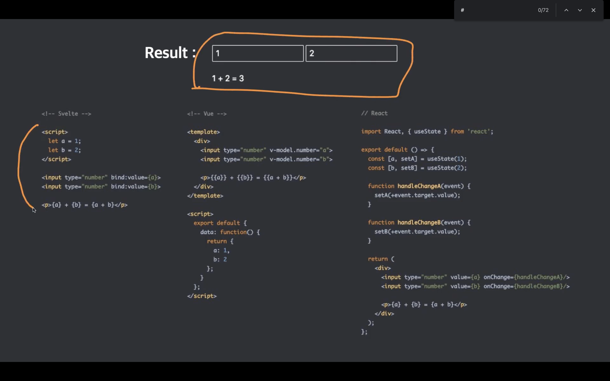

# Svelte TODO + MOVIE APP

Junction X 해커톤에서 써먹기 위한 Svelte 연습 + RXJS

## 할것

- [x] TODO 리스트 만들기
- [x] 라우팅
- [ ] 무비앱 만들기 + 비동기 요청 + RxJs 사용해보기
- [x] Svelte Store 사용해보기
- [ ] 환경변수 적용
- [ ] 스니펫 만들기

## RXJS 도입 관련해서

Svelte가 확실하게 강점을 보이는 곳에 굳이 RXjs까지 쓸 필요는 없을거같음. 약점을 보완하자!

1. 여러가지 선언적인 값들 : $를 사용할 수 있으니 별문제 없을듯(이미 선언적) prop으로 받은 얘들을 일관성있게 가공하는 API로 쓴다면 어떨까
2. **interval, timeOut** : setInterval이나 setTimeout은 명령적이기 때문에 선언적인 값으로 사용할 수 있다면 rxjs 사용도 괜찮을듯함 => 구독해제 시점?
3. **http request** : 이거는 RxJS로 해보면 좋을듯. 여러 가공 로직까지 간결하게 선언형으로 짤 수 있을거같음..근데 로직이 너무 긴데...???? 그리고 async block 쓰는게 더 나을지도 모름
4. 좀 복잡한 이벤트 관련 로직 : RxJS로 해보면 좋을 것 같으나 그렇게 복잡한 이벤트로직 처리를 할 수 있을까 잘 모르겠음
5. store: [Rx에서 영감을 받아 구현한 지점이 있는 만큼](https://svelte.dev/docs#Store_contract) 굳이 적용하지 않아도 될듯. 그리고 $ prefix 어떻게 작동하는거지..? => 스토어 변수랑 컴포넌트 로컬 변수랑 구분이 잘 안될수도 있어서 의도에 조금 반하는 부분도 있음

## Svelte 특기할만한 사항



### 특징

- 스스로를 프레임워크가 없는 프레임워크, 컴파일러라고 소개
- 가상돔이 없고, 런타임에 로드할 프레임워크가 없음
- 빌드 단계에서 구성요소를 컴파일하는 도구. 페이지에 단일 번들을 사용할 수 있음
- write less code : 높은 가독성, 개발시간 단축, 쉬운 리팩토링, 쉬운 디버깅, **더 작은 번들**, 낮은 러닝 커브
- no virtual dom : 빠른 성능, diffing 안함, 오버헤드 없음
  - 런타임에서 리액트보다 **메모리를 3배를 덜쓴다.**
- Truly reactive : 찐 반응성
  - 런타임에서 프레임워크가 사용되지 않고, **바닐라 JS로 결과물을 컴파일해서 브라우저에 띄운다**
  - 반응성이 동작하는 방식 : 이벤트 핸들러가 state를 업데이트한다면, 이미 작성한 코드를 가지고 언제 반응성이 일어나는지 미리 예상하고, 그 결과물을 브라우저에서 만들어내는 방식으로 렌더링.
  - 순수한 자바스크립트가 브라우저에서 돌아간다.
  - dev dependency만 있으면 된다 == svelte가 svelte 코드를 바닐라 JS로 컴파일하고 그 결과만 동작시키기 때문에 svelte는 브라우저에서 동작하지 않는 컴파일러라고 할 수 있음
  - 명시적 설계 : 사용자가 직접 반응성을 만들어낸다
  - 변경된 값이 DOM에 자동으로 반영된다 : 그냥 데이터 값만 바꿔주면 바로 반영됨 리액트처럼 불변성을 신경써야 한다거나 할 필요가 없고 새롭게 **할당**만 시키면 된다
- 단점
  - 낮은 성숙도와 작은 생태계 : 문법 대격변 + 라이브러리 많이 없음
  - CDN 미제공 : 컴파일러기 때문에 어쩌면?
  - IE지원이 걍 없음 : 아예 안되는건 프로덕션 도입에는 문제가 있을수도?

### 특기할만한 사항

#### prop modify

```jsx
// prop modify

<script>
  import Fruits from "./Fruits.svelte";

  let fruits = ["Apple", "Banana", "Cherry", "Orange", "Mango"];
</script>

<Fruits {fruits} />
<Fruits {fruits} reverse />
<Fruits {fruits} slice="-2" />
<Fruits {fruits} slice="0, 3" />
```

#### 라이프 사이클

- onMount : 컴포넌트가 연결된 직후 콜백 실행
- onDestroy : 컴포넌트가 연결 해제되기 직전
- beforeUpdate : 컴포넌트의 데이터가 업데이트되기 직전
- afterUpdate : 컴포넌트의 데이터가 업데이트된 직후
- tick : 변경된 데이터가 화면에 반영될때까지 기다림
  - 데이터 변경 후 화면의 갱신까지 기다림(Vue에서의 nextTick)
  - 비동기로 실행
- 생긴건 그냥 함수기때문에 컴포넌트 외부에서 모듈화를 해도 됨

```js
<script>
  import { tick } from 'svelte'

  let name = 'world'

  async function handler() {
    name = 'Heropy'
    await tick()
    const h1 = document.querySelector('h1')
    console.log(h1.innerText) // Hello Heropy!
  }
</script>

<h1 on:click={handler}>Hello {name}!</h1>
```

#### 반응성

- svelte에서의 반응성 갱신은 할당 연산자를 사용. push나 splice같은건 안됨
- 기본형은 그냥 할당, 참조형은 modify해서 새로운 배열이나 객체를 할당

#### 반응성 구문

- $ : 순수한 자바스크립트 label 구문(반복문같은거 레이블링 하는 문법 - JS에도 있구나 이런게..) 데이터 변경이 아닌 반응성을 계측하는 것. 데이터의 변경이 즉각 반영되지 않음. (Vue의 computed) 한번만 초기화되는 prop같은 경우 tick없이 유용하게 사용할 수 있을듯?

```jsx
<script>
  let count = 0

  // 선언
  $: double = count * 2

  // 블록
  $: {
    console.log(count)
    console.log(double)
  }

  // 함수 실행
  $: count, log()

  // 즉시 실행 함수(IIFE)
  $: count, (() => {
    console.log('iife: Heropy')
  })();

  // 조건문(If)
  $: if (count > 0) {
    console.log('if:', double)
  }

  // 반복문(For)
  $: for (let i = 0; i < 3; i += 1) {
    count
    console.log('for:', i)
  }

  // 조건문(Switch)
  $: switch (count) {
    case 1:
      console.log('switch: 1')
      break
    default:
      console.log('switch: default')
  }

  // 유효범위
  $: {
    function scope1() {
      console.log('scope1')
      function scope2() {
        console.log('scope2')
        function scope3() {
          console.log('scope3', count)
        }
        scope3()
      }
      scope2()
    }
    scope1()
  }

  function log() {
    console.log('fn: Heropy!')
  }
  function assign() {
    count += 1
  }
</script>

<button on:click={assign}>Assign!</button>
```

#### 속성 바인딩

- 디렉티브로 바인딩. 근데 Vue의 디렉티브 바인딩보다 더 단순한듯

```jsx
// 클래스 바인딩 - 변수의 참거짓여부(굉장히 선언적이네유)
<div class:active={active}>
  Hello
</div>

// 스타일 바인딩
<h2
  style="
  background-color: {color};
  color: {white};
  {letterSpacing}"
>
  Heropy!
</h2>
```

```jsx
<script>
  let active = true
  let valid = false
  let camelCase = true
  let color = {
    white: '#FFF',
    red: '#FF0000'
  }
  let bold = 'font-weight: bold;'

  function multiClass() {
    return 'active valid camel-case'
  }
</script>

<div class={active ? 'active' : ''}>
  3항 연산자 보간
</div>

<div class:active={active}>
  Class 지시어(Directive) 바인딩
</div>

<div class:active>
  Class 지시어 바인딩 단축 형태
</div>

<div
  class:active
  class:valid
  class:camelCase
  class:camel-case={camelCase}>
  다중 Class 지시어 바인딩
</div>

<div class={multiClass()}>
  함수 실행
</div>

<div
  class="style-binding"
  style="
    color: {color.white};
    background-color: {color.red};
    {bold}">
  스타일 바인딩
</div>
```

### 스타일 유효범위

- <style> 로 스타일 선언하면 기본적으로 해당 컴포넌트에 scoped됨 Vue처럼
- 이를 위해서 class 속성에 svelte hash가 추가된다
- 글로벌 모디파이어를 주면 전역으로 선언 가능 : 해쉬가 사라짐

```jsx
<style>
  :global(ul.container li.item) {
    width: 100px;
  }
</style>
```

### 요소 바인딩

- bind:this를 통해 바로 요소 참조 가능
- 화면에 없던 요소가 생기고 나서 binding을 해야할 경우 갱신까지 기다리도록 tick 사용
- 입력요소는 bind:value 이런식으로 => 기본적으로 value 속성을 통해 데이터를 연결하며, 많은 경우 양방향 데이터 바인딩을 위해 bind 지시어 사용 (**양방향 데이터 바인딩!!**)

```jsx
// 요소 바인딩

<script>
  import { tick, onMount } from 'svelte'

  let isShow = false
  let inputEl // 요소가 들어갈 변수

  async function toggle() {
    isShow = !isShow
    await tick() // 이것도 진짜 선언적이네
    // const inputEl = document.querySelector('input')
    console.log(inputEl)
    inputEl && inputEl.focus()
  }
</script>

<button on:click={toggle}>Edit!</button>
{#if isShow}
  <input bind:this={inputEl} />
{/if}
```

### 리스트 렌더링시 key

- 문법이 희한함

```jsx
<ul>
  {#each fruits as fruit (fruit.id)}
    <li>{fruit.name}</li>
  {/each}
</ul>
```

### 키 블록

- 뭉뜽그려진 반응성, Vue의 watch 속성
- 블록 안에서 Svelte를 사용하는 경우, 컴포넌트가 초기화되고 연결됨

```jsx
<script>
  import Count from './Count.svelte'
  let reset = false
</script>

{#key reset}
  <Count />
{/key}

<button on:click={() => reset = !reset}>
  Reset!
</button>
```

### 비동기 블록

- 와 이게뭐노..
- 비동기 요청 결과물이 담기는 Promise 변수를 연결하여 프로미스의 상태를 매우 직관적으로 화면에 반영할 수 있음
- React에서 요즘 새로 나오는 비동기 렌더링 그느낌이네

```jsx
{#await promise}
  <!-- pending(대기) -->
  <p style="color: royalblue;">loading...</p>
{:then movies}
  <!-- fulfilled(이행) -->
  <ul>
    {#each movies as movie}
      <li>{movie.Title}</li>
    {:else}
      <li>검색된 결과가 없어요...</li>
    {/each}
  </ul>
{:catch err}
  <!-- rejected(거부) -->
  <p style="color: red;">{err.message}</p>
{/await}
```

### 이벤트 바인딩과 이벤트 수식어

- 이건 정말 Vue랑 비슷함
- 바인딩은 기본적으로 `on:click={() => {}}` 이렇게 하고
- 수식어는 바로 뒤에 |로 해서 붙임 `on:click|preventDefault|capture|self|once={() => console.log('!')`
- preventDefault, stopPropogation, passive, capture, once(한번 하고 핸들러 삭제??!!) 지원

### 기본적으로 데이터 흐름은 단방향인데 이벤트 에미터도 지원함

- Vue랑 같은데
- 개인적으로 emit은 한 컴포넌트에 로직이 많이 몰리게 하고 자식 컴포넌트에 prop말고 다른 이벤트 핸들러까지 덕지덕지 붙여야 한다는 점에서 선호하지는 않음.. 단방향으로 계속 쓸거같긴 함. 근데 Vue 쓸때는 리액트처럼 함수 prop같은 것이 컨센서스가 아니라서 emit을 사용하기는 했음

```jsx
// 자식
<script>
  import {createEventDispatcher} from 'svelte' const dispatch =
  createEventDispatcher() const 전달할_데이터 = '나는 데이터!'
  dispatch('이벤트_이름', 전달할_데이터)
</script>

// 부모
<script>
  import Child from './Child.svelte'
</script>

<Child on:이벤트_이름={event => {
  console.log(event.detail) // '나는 데이터!'
}} />
```

### contextAPI도 지원

- ?? 갑분 리액트
- 근데 자주 쓸거같지는 않넹

### 슬롯

- 이것도 용어는 Vue의 개념인데 React의 children에 더 가까운 느낌인듯?

```jsx
<script>
  import Hello from './Hello.svelte'
</script>

<!--요소의 내용-->
<h1>Hello world!</h1>

<!--컴포넌트의 내용-->
<Hello>Hello world!</Hello>


// Hello.svelte
<h2>
  <!--내용은 <slot>에 들어감!-->
  <slot></slot>
</h2>
<p>I'm 'Hello' Component.</p>

// fallback
<slot>Fallback content, 들어오는 내용이 없으면 이 문장을 출력합니다!</slot>
```

### 네임 슬롯

- 이거는 확실히 Vue군..

```jsx
// 실사용
<script>
  import Card from './Card.svelte'
</script>

<Card>
  <div slot="age">85</div>
  <h2 slot="name">Heropy</h2>
  <div slot="email">thesecon@gmail.com</div>
</Card>

<Card>
  <span slot="email">neo@abc.com</span>
  <h3 slot="name">Neo</h3>
</Card>

<style>
  h2 {
    font-weight: 400;
  }
  h3 {
    color: red;
  }
</style>

// 슬롯 컴포넌트

<div class="card">
  <slot name="name"></slot>
  <slot name="age">??</slot>
  <slot name="email"></slot>
</div>

<style>
  .card {
    margin: 20px;
    padding: 12px;
    border: 1px solid gray;
    border-radius: 10px;
    box-shadow: 4px 4px 0 rgba(0,0,0,.1);
  }
</style>
```

### Svelte store

- readable, writable, derived로 정의된 스토어 객체는 기본적으로 subscribe 메소드를 포함하며, writeable로 정의된 객체는 추가로 set과 update메소드를 활용할 수 있음
- 컴포넌트에서는 메소드 사용할 것 없이 $ 접두사로 스토어를 참조할 수 있음(자동 구독)
- get 메소드를 사용하면 구독하지 않고 스토어의 값을 얻을 수 있음

#### writable

- 첫번째 인수는 스토어의 값
- 두번째 인수는 스토어 구독이 발생하면 실행될 콜백. 콜백에서 반환하는 함수는 구독이 모두 취소되면 실행
- get 메소드를 사용하면 구독을 하지 않고 store 객체의 값만 얻을 수 있음
- 컴포넌트단에서는 변수를 임포트해서 subscribe 해주고
- update 메소드로 값을 새로 써줄 수 있음
- 역시 $를 통해 자동구독을 할 수 있어서 자동구독을 하면 그 다음부터는 컴포넌트 변수처럼 사용 가능

```js
import { writable } from "svelte/store";

// 컴포넌트에서 바로 쓸 수 있기 때문에 초기값이 비어있어도 될듯
export let store = writable("값", () => {
  // 구독자가 1명 이상이 되면 실행!

  return () => {
    // 구독자가 0명이 되면 실행!
  };
});

// writeable 자동 구독 및 변경

<script>
  import { name, count } from './store.js'
</script>

<button on:click={() => {
  $count += 1 // Increase
  $name = 'Neo' // Change name
}}>
  Click me!
</button>

<h2>{$count}</h2>
<h2>{$name}</h2>
```

#### readable

읽을수만 있는 스토어값

```js
import { readable } from "svelte/store";

const userData = {
  name: "Heropy",
  age: 85,
  email: "thesecon@gmail.com",
  token: "Ag1oy1hsdSDe",
};

export let user = readable(userData, (set) => {
  console.log("user 구독자가 1명 이상일 때!");
  delete userData.token;

  // 초기값을 최초 한번 수정할 수 있도록 콜백에서 함수를 사용할 수 있음
  set(userData);
  return () => {
    console.log("user 구독자가 0명일 때...");
  };
});
```

#### derived

계산된 스토어. Vuex의 getter

```js
import { writable, derived } from "svelte/store";

export let count = writable(1);

// count로 만들어낸 값
export let double = derived(count, ($count) => $count * 2);

// count와 double로 만들어낸 값. 여러개 변수를 차용할때는 배열을 사용
// 통상적으로 매개변수 앞에 $를 붙여서 스토어의 값이라는 의미를 부여함
export let total = derived([count, double], ([$count, $double], set) => {
  console.log("total 구독자가 1명 이상일 때!");
  set($count + $double);
  return () => {
    console.log("total 구독자가 0명일 때...");
  };
});

// count로 만들어낸 값
export let initialValue = derived(
  count,
  ($count, set) => {
    setTimeout(() => set($count + 1), 1000);
  },
  "최초 계산 중..."
);
```

#### 커스텀 스토어

- 스토어 객체의 메소드가 포함된 객체를 커스텀 스토어라고 함
- 다른 속성이나 메서드를 사용할 수 있다는 장점이 있음
- 스토어의 수동/자동 구독을 위해 subscribe 메소드는 포함되어야 함
- 스토어를 객체로 선언하는게 가능
- 스토어를 분할해야하는 경우 이렇게 쓰는게 좋은 용례인듯 싶음

```jsx
import { writable, get } from "svelte/store";

const _fruits = writable([
  { id: 1, name: "Apple" },
  { id: 2, name: "Banana" },
  { id: 3, name: "Cherry" },
]);

export let fruits = {
  // subscribe를 포함시키기 위해서 전개연산자 사용
  // 근데 이렇게하면 한 값과 그 값과 관련된 메소드 하나만 가능하겟네 아닌가 뭐 연산은 복합적으로 쓸 수 있다 하더라도
  ..._fruits,
  getList: () => get(_fruits).map((f) => f.name),
  setItem: (name) =>
    _fruits.update((f) => {
      f.push({
        id: f.length + 1,
        name,
      });
      console.log(f);
      return f;
    }),
};

// 아 이렇게하면 되겟네

import { writable } from "svelte/store";

export const state = writable({
  counter: 0,
  todos: [],
  randomFact: "Svelte can be easy",
});

export let userInfo = {
  ...state,
  getList: () => get(_fruits).map((f) => f.name),
  setItem: (name) =>
    _fruits.update((f) => {
      f.push({
        id: f.length + 1,
        name,
      });
      console.log(f);
      return f;
    }),
};
```
